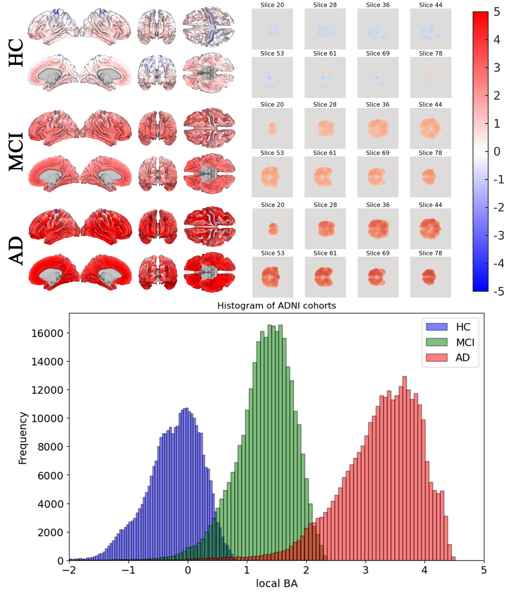

# USC LBA estimator

# Voxel-wise Local Brain Age Mapping via Generative Deep Learning

This repository contains the implementation of the novel framework for **voxel-wise Local Brain Age (LBA) estimation** described in the paper "Generative deep learning maps local brain aging across human adulthood." This approach uses a **V-Net architecture** ([paper](https://arxiv.org/abs/1606.04797), [pytorch inspiration](https://github.com/mattmacy/vnet.pytorch?tab=readme-ov-file)) to produce high resolution, subject-specific maps of brain aging from T1-weighted MRI scans, providing a more nuanced biomarker than traditional global brain age ([GBA](https://github.com/irimia-laboratory/USC_BA_estimator/)) estimates.

## Overview

The framework reframes the brain age estimation problem as a **generative, spatially resolved mapping task**. Unlike GBA models, which yield a single age value, this model produces a $128^3$ volume of Local Brain Age (LBA) estimates, quantified in years, at the voxel level.

The output can be converted to **Local Age Gap (LAG = LBA - Chronological Age)**, which highlights areas where the brain appears older or younger than expected for the participant's chronological age.

## Methodology

### V-Net Architecture

The core of the framework is a **V-Net architecture**, a variation of the U-Net model adapted for 3D volumetric medical image processing.

  * **Input:** T1-weighted, preprocessed and skull-stripped brain MRIs using Freesurfer's (FS) [recon-all](https://surfer.nmr.mgh.harvard.edu/fswiki/recon-all). The brain.mgz files obtained from recon-all are downsampled to $128^3$ which are input to the model.
  * **Structure:** Consists of a 3D Convolutional Neural Network (CNN) encoder and a decoder with **skip connections** to transfer fine MRI structural information, critical for high-resolution output. The model uses **nearest neighbor upsampling** in the decoder instead of transposed convolutions to avoid "checkerboard" artifacts in the predicted images.
  * **Output:** Voxel-wise estimations of LBA (volume size: $128^3$).
  * **Training:** Trained using the **Mean Absolute Error (MAE) loss function** and the **Adam optimizer** on a multi-site dataset of 14,748 cognitively normal healthy control (HC) participants.
#### Training Datasets
| **repository** | set   | $N$    | min Age                            | max Age       | $\mu$ Age                              | $\sigma$ Age | M:F   | FS 6.0.0  | FS 7.1.1 |
|----------------|-------|--------|--------------------------------|-----------|------------------------------------|----------|-------|--------|-------|
| **CamCAN**     | train | 651    | 23                             | 88        | 54.2                               | 18.6     | 1:1.0 | 0      | 651   |
| **HCP-A**      | train | 510    | 36                             | 80        | 55.8                               | 12.0     | 1:1.4 | 309    | 201   |
| **IXI**        | train | 563    | 36                             | 80        | 56.3                               | 12.0     | 1:1.1 | 563    | 0     |
| **NACC**       | train | 3,027  | 19                             | 100       | 69.3                               | 10.7     | 1:1.2 | 0      | 3,027 |
| **UKBB**       | train | 9,997  | 45                             | 82        | 64.4                               | 7.8      | 1:1.1 | 9,997  | 0     |
| **All**        | train | 14,748 | 19                             | 100       | 64.7                               | 10.8     | 1:1.3 | 10,869 | 3,879 |
| **ADNI-HC**    | test  | 1102   | 56                             | 95        | 75.8                               | 6.2      | 1:1.0 | 1102   | 0     |
| **ADNI-MCI**   | test  | 354    | 55                             | 92        | 73.1                               | 8.2      | 1:0.8 | 354    | 0     |
| **ADNI-AD**    | test  | 529    | 55                             | 96        | 76.0                               | 8.2      | 1:1.1 | 529    | 0     |

Sample size $N$, descriptive statistics (minimum min, maximum max, mean $\mu$, and standard deviation $\sigma$), the male-to-female (M:F) ratio, and breakdown by FreeSurfer (FS) version used for MRI preprocessing. Demographics are listed for each repository. All subjects were cognitively normal. Abbreviations:CA = chronological age, CamCAN = Cambridge Centre for Aging and Neuroscience, HCP-A = Human Connectome Project - Aging, UKBB = UK Biobank, M = male, F = female.

### Semi-Global Bias Correction

To mitigate the [systematic bias](https://arxiv.org/pdf/2405.15950?) where deep learning models tend to underestimate the age of older individuals and overestimate the age of younger ones, a novel semi-global bias correction approach is applied.

1.  **Voxel-wise Coefficients:** A bias correction coefficient is initially estimated for **each voxel** in the brain.
2.  **Uniform Correction:** The **median** of all these voxel-wise coefficients is then used to perform bias correction **uniformly** across the entire brain scan. This preserves the biologically meaningful regional variability in LBA while correcting the global age prediction bias.

-----

## Results Highlights

  * **Aging Gradient:** Frontal areas, temporal poles, and anterior periventricular white matter showed the **most advanced aging** (older LBA), while the basal ganglia, thalamus, occipital cortex, and posterior white matter exhibited **younger LBAs**.
  * **Disease Distinction:** The brain-averaged LAGs showed clear separation between cognitively normal and impaired groups:
      * **HC:** Mean LAG $\mu \approx 0$ years.
      * **MCI:** Mean LAG $\mu \approx 1.6$ years.
      * **AD:** Mean LAG $\mu \approx 3.5$ years.
  * **Key Affected Regions in AD:** The largest LBA differences between the AD and HC groups were observed in subcortical structures like the **pallidum**, **ventral diencephalon**, and **putamen**, and cortically in the **temporal and parietal lobes**, including the right **hippocampus** and right **amygdala**.


Group differences: 

The color scale on the right ranges from -5 y to 5 y. The x axis on the histogram displays local brain age gap in years ranging from -2 to 5 years.

-----

## Run Inference
Run ONNX inference on `.mgz` brain volumes using [main.py](main.py). The script loads a CSV (for metadata), scans a directory for `.mgz` files, and saves predictions as `.npy` files.

## Quick Start
1) Place your inputs:
- `.mgz` files in `./data/`. These are brain.mgz files obtained from Freesurfer's recon-all pipeline for each subject. Please ensure that the filenames are unique and correspond to the IDs in the CSV file.
- `ages.csv` in `./data/` (contains chronological ages of the brains in the brainsDir with their corresponding filenames).

For example
```text
project-root/
├── main.py
├── README.md
├── data/
│   ├── ages.csv
│   ├── 383_brain.mgz
│   ├── 518_brain.mgz
│   └── ...
└── ...
```

  Then csv should look like this:

  ```csv
  ID,CA
  383,55
  518,68

  ```
  - Edit the paths in [main.py](main.py):

```python
csvFileLoc = r"./data/ages.csv"
brainsDir = r"./data/"
saveFlag = True # this flag controls whether to save the output predictions as .npy files
saveLoc = r"./outFiles/"
```

2) Install dependencies in a virtual environment:
- Python 3.8+
- Dependencies used by [inference.py](inference.py): `onnx`, `onnxruntime`, `torch`, `numpy`, `scipy`, `nibabel`, `pandas`


Linux/Mac:
```
pip install --upgrade pip
python -m venv venv
source venv/bin/activate 
pip install -r requirements.txt
```

Windows:
```
python -m pip install --upgrade pip
python -m venv .lbavenv 
.lbavenv\Scripts\activate.bat
pip install -r requirements.txt
```


3) Run:
```bash
python main.py
```

4) Outputs:
- `.npy` prediction files in `./outFiles/`


## Optional: Run Inference Directly
[inference.py](inference.py) also exposes a CLI. Example:

```bash
python inference.py --brains-dir ./data/ --save-flag true --save-loc ./outFiles/ --model-path LBAmodel.onnx
```

utils.py contains helper functions for loading `.mgz` files and visualizing brain volumes. You can import and use these in your own scripts or notebooks.
plot3Views function in utils.py:
- Extracts three slices: axial (`z`), sagittal (`x`), and coronal (`y`).
- Plots them side-by-side with colorbars.


-----

## Citation

If you use this work, please cite the original paper:
Coming soon!
```
[Citation for the paper]
```