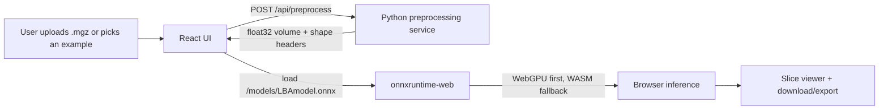

# Browser WebGPU Architecture for Local Brain Age

This repo can move to a React + onnxruntime-web browser runtime without changing the Python preprocessing path.

## Target split



## Responsibilities

### Python backend

Keep the MGZ-specific work in Python:

- read `.mgz` with `nibabel`
- downsample with `scipy.ndimage.zoom`
- preserve the current preprocessing behavior and mask semantics
- return a contiguous `float32` volume and its shape to the browser

The backend should not run model inference in the new browser flow.

### React frontend

The React app becomes the user-facing shell:

- file upload and bundled example selection
- browser-side ONNX session creation
- WebGPU execution where supported, WASM fallback otherwise
- interactive slice index and color range controls
- 3-view visualization of input and prediction volumes

### ONNX runtime in the browser

Use `onnxruntime-web` with the execution provider order:

1. `webgpu`
2. `wasm`

The model is loaded once and reused across cases. The browser receives a preprocessed `float32` tensor shaped like `[1, 1, D, H, W]`, which is the same layout the Python inference path already expects.

## Data contract

Recommended API contract between Python and React:

- `POST /api/preprocess` accepts a `.mgz` file upload
- response body is raw little-endian `float32` bytes
- response headers include `X-Volume-Shape: x,y,z`
- the frontend reconstructs the typed array and feeds it directly into ONNX Runtime Web

That avoids JSON bloat for large 3D arrays and keeps the browser payload simple.

## Suggested project layout

```text
localBA/
├── backend/
│   └── app.py
├── web/
│   ├── package.json
│   ├── vite.config.js
│   └── src/
│       ├── App.jsx
│       ├── main.jsx
│       └── lib/
│           ├── api.js
│           ├── ort.js
│           └── volume.js
├── LBAmodel.onnx
├── 1_brain.mgz
├── 2_brain.mgz
└── README.md
```

## Implementation notes

- Keep the current preprocessing logic in one Python helper so Streamlit, Gradio, and the new API all use the same volume preparation path.
- If the browser build is served from the same host as the backend, the model can be fetched from `/models/LBAmodel.onnx` without extra CORS work.
- For local development, proxy `/api`, `/models`, and `/examples` from Vite to the Python server.
- If you later need pure-browser preprocessing, that is a separate project because MGZ decoding is much easier to keep in Python.

## Migration steps

1. Stand up the backend endpoint that returns preprocessed volumes.
2. Add the React shell and wire file upload to the preprocessing endpoint.
3. Load `LBAmodel.onnx` with `onnxruntime-web` and enable WebGPU first.
4. Move the existing slice visualization into React canvas or Plotly components.
5. Retire the Streamlit/Gradio UI once the browser build reaches parity.